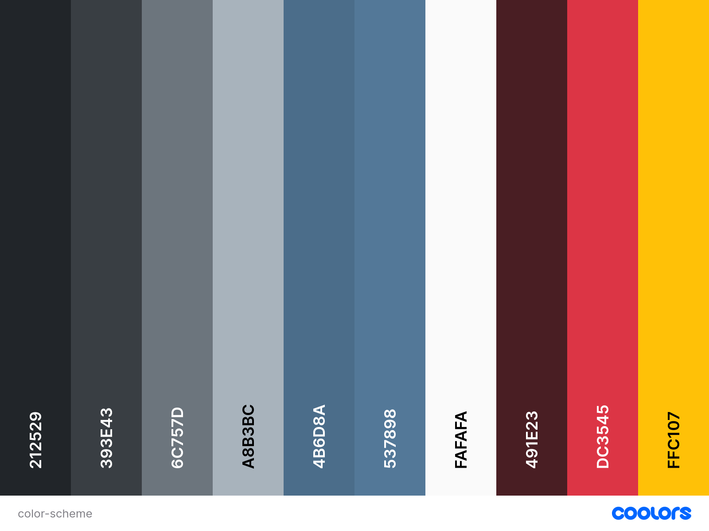
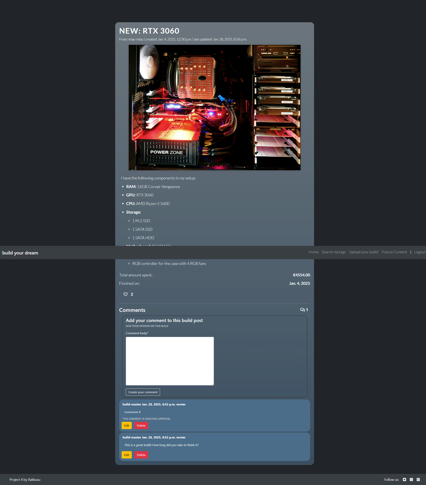
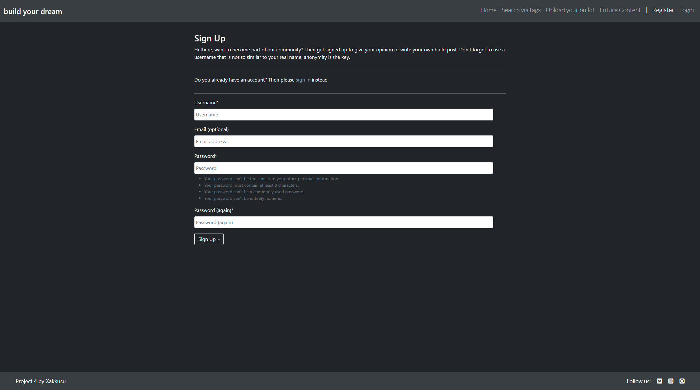
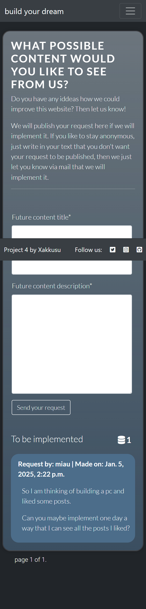
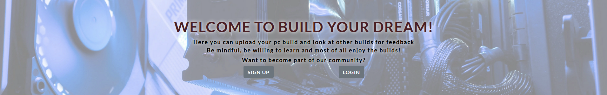
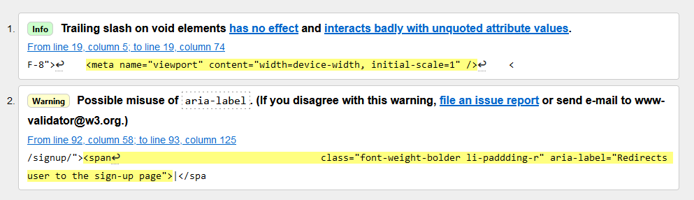

# Build your Dream
Build your dream is a imaginary blog where users can share their own pc builds, find inspiration from other builds and interact with other pc-builders. Here everyone can see what is out there before, during and after building your own computer. 

It is meant to be a place for people to exchange information and just show off their work. Hence the target audience are pc enthusiats who want to present their own build with helpful imformation for future pc builders and for those future pc-builders to get inspired by others work.
The post will have professional tags by the build-your-dream-team so that users can search through the contents by parts and characteristics they are looking for. Moreover users can express their feelings about a post via comments and a like function.

Moreover as this imaginary website is still new and wants to adapt to the users' needs, users can give recommendation of what changes and possible features they would implement on the blog. Therefore, Build Your Dream tries to build a growing community of builders that want to exchange information with one another in a respectful way.

[Build Your Dream - Deployed website](https://build-your-dream-87f4998d58a9.herokuapp.com/)

## Contents
- [SITE OWNER GOALS](#site-owner-goals)
- [USER EXPERIENCE (UX)](#user-experience-ux)
- [WIREFRAMES](#wireframes)
- [AGILE](#agile)
- [ENTITY RELATIONSHIP DIAGRAM - ERD](#entity-relationship-diagram---erd)
- [FINAL DESIGN](#final-design)
    - [Imagery](#imagery)
    - [Color Scheme](#color-scheme)
    - [Typography](#typography)
    - [Visual Effects](#visual-effects)
    - [Final Look](#final-look)
- [FEATURES](#features)
    - [Index Page](#index-page)
    - [Show Build Page](#-page)
    - [Search build via tags](#-page)
    - [Create Build Post](#-page)
    - [Edit Build Post](#-page)
    - [Delete Build Post](#-page)
    - [Future Content](#future-)
    - [404 Page](#404-page)
    - [403 Page](#403-page)
- [TESTING](#testing)
    - [Accessibility](#accessibility)
        - [Wave Testing](#wave-testing)
        - [Lighthouse Testing](#lighthouse-testing)
    - [W3C Validators](#w3c-validators)
    - [JSHint](#jshint)
    - [PEP8](#pep8)
    - [Form Testing](#form-testing)
    - [Links Testing](#links-testing)
    - [Browser Testing](#browser-testing)
    - [Device Testing](#device-testing)
    - [User Stories Testing](#user-stories-testing)
    - [Fixed Bugs](#fixed-bugs)
- [TECHNOLOGIES USED](#technologies-used)
    - [Languages](#languages)
    - [Frameworks, Libraries and Programs used](#frameworks-libraries-and-programs-used)
- [DEPLOYMENT](#deployment)
- [CREDITS](#credits)
    - [Media](#media)
    - [Resources](#resources)
- [ACKNOWLEDGEMENTS](#acknowledgements)

## SITE OWNER GOALS

- to provide the user with an informative website about pc builds
- to provide the user with the ability to become part of a community of pc builders
- to provide the user with the opportunity to upload, edit and delete their own pc build with information about it
- to provide the user with the opportunity to comment on ones own or others' pc builds, the comments can be edited and deleted
- to provide the user with the ability to search all posts via their tags
- to provide the user with the ability to show their appreciation of a post with likes
- to provide the user with the ability give input on what features the website could need and hence become a part of the development process
- to provide the user with a save space, where content is approved so bullying and other problematic behaviour is limited

## USER EXPERIENCE (UX)
#### First Time User Goals
- As a user I can read about pc builds.
- As a user I can register an account so that post content, comment and give feedback.
- As a user I can create a post so that I can show off my build for other users to enjoy.
- As a user I can use any device I want and the design will respond accordingly so that I am not bound to use only one device/browser.
- As a user I can naviagte through the main topics so that I can jump to whichever topic I want from one menu bar.

#### Returning User Goals
- As a user I can like the post and it's content so that how I thought about the build is represented.
- As a user I can modify or delete my comment on a post so that I can correct my opinion or delete my input from the post.
- As a user I can modify or delete my posts so that I can correct my content or delete it.
- As a user I can comment on a post so that I can give my opinion on the post.
- As a user I can see comments on a post so that can read what other people have to say about the post.

#### Frequent User Goals
- As a user I can create tags on my posts and comments so that it can be searched by them.
- As a user I can search through the posts so that can find what I want to.
- As a user I can view all tags so that I can browse through them.
- As a user I can indicate the status of my input so that I know if those things will be implemented one day or not.
- As a user I can give input/feedback so that in the future there will be new features on the website.
> additionaly the returning user goals apply here as well

## WIREFRAMES
Wireframes were produced using Balsamiq. 

 

 
Desktop Wireframes

Index Page:

Show Build Post Page:

Add/Edit Build Post Page:

Delete Build Post Page:

Search build via tags Page:

Future Content Page:

Sign-Up Page:

Login Page:

Logout Page:

404 Page:

 

 

    
Mobile Wireframes

Index Page:

Show Build Post Page:

Add/Edit Build Post Page:

Delete Build Post Page:

Search build via tags Page:

Future Content Page:

Sign-Up Page:

Login Page:

Logout Page:

404 Page:

## AGILE
The agile metholody way applied for this project. The To-Do's were split according to their uer stories into sprints. To graphically represent this and not just have each sprint with its goals, tests etc on paper Github's project board was used to show this each springt and tasks as well. As I also use the agile system in my professional life (project management) I didn't always update the digital board and move user stories as I did it in my notes, hence you can see in the documentation of the board that a lot of stories were done at once. However, through my commits one can see that after each small step that worked, and through a lot of testing and fixing the code in between, one can see how this framework was well implemented into each step/sprint of the project.

>[Project Board](https://github.com/users/Xakkusu/projects/5)

My mentor adviced me to only keep sprints that are within the scope of my project. So I also implemented a section called "for next run" where future sprints are in that are possible future features but are not needed in the current project.

##  ENTITY RELATIONSHIP DIAGRAM - ERD
The following diagram illustrates the models used in this project and their relationships to one another:

The user model is created by [Django AllAuth](https://docs.allauth.org/en/latest/) library for user authentication, hence it was not written by me but solely installed and used. The taggit_tag was created by the [django-taggit](https://django-taggit.readthedocs.io/en/latest/) application and used for its well developed tagging system.

## FINAL DESIGN
### Imagery
It was chosen to include no images besides the build post images into this project. This was done after intense research into similar websites as well as question being asked to people that enjoy similar content. As the user can upload an image themselves the superuser can still decide through their approval process if this image is fitting or if it will not be shown.
The only image used is the one of the default build post and the hero image. Both where chosen in-synch with the projects colour scheme, of which you can find out more [here](#color-scheme). The default images fits the card sizing more as we figured that most people would upload an image of their build to show it off. However, it is still a pleasing image. The hero image was brightened a lot to make it stand out and makle it easier to read the text on it. Both are of greyish pc builds, which is commom for this kind of content. The rathe dry styling fits the theme as well.

### Color Scheme

In tone with most pc build related content A greyish color range was chosen. As most pc build themselves are mostly still black and grey it was seen as fitting for this project. Depending on the content the colors vary. The only exception are edit and delete buttons, with a more yellor and a distinct red color. The colors also do not take away from the content and perfectly keep the users focus on the build post, especially on the uploaded images. It was important to not make the website too dark and hence make it unpleasend to spend more time on the posts. The main color of the font is either complete white as in the bootstrap settings for a lot of the color related keywords or a #fafafa was chosen as it is a tat more pleasing for the eye, but in some cases it does not make the text stand out as much at it needs to be. Hence, especially when bootstrap was used in styling content the #fff (white) color is used. Yet this color still is in line with the color scheme.
The color palette was created by using the [coolors](https://coolors.co/) website.

### Typography
- As bootstrap styling devices were used througout this website, the main fallback font where a native font stack is used which selects the best font-family for each OS and device, more on this [here](https://getbootstrap.com/docs/4.0/content/typography/).
[Google Fonts](https://fonts.google.com/) was used for the following fonts:
-  
[Lato](https://fonts.google.com/specimen/Lato?query=Lato)
was chosen for all content where the user can either directly see the content of a post and give feedback to it (show build post and future content requests) and the navbar items to make them stand out to the user and indicate that this is their main content to interact with. The font was chosen as it is simple yet it fits the content and pc builds, therefore it stays in line with the website's styling.
-  
[Roboto](https://fonts.google.com/specimen/Roboto?query=Roboto)
was used for buttons and links that are not directly related to editing content, yet still show the user that they can do something "different" when interacting with it. It is again a simple font that many pc related websites use. 
- Sans Serif was chosen as a backup font, in case for any reason the main font isn't being imported into the site correctly.

### Final Look

Desktop

Index Page:

Show Build Page:

Create Build Page:

Edit Build Page:

Delete Build Page:

Future Content Page:

Search Page:

Login Page:

Sign-Up Page:

Logout Page:

404 Page:

Mobile

Index Page:

Show Build Page:

Create Build Page:

Edit Build Page:

Delete Build Page:

Future Content Page:

Search Page:

Login Page:

Sign-Up Page:

Logout Page:

404 Page:

## FEATURES

All pages are responsive, if content can be interacted with the cursor will become a pointer . Other things they have the following in common:

#### Navbar

Desktop:

- All pages have a navbar fixed at the top of the page.
- This shows the title which is selectable and redirects the user to the landing page.
- It also show the main menu items which when hovering have a lighter backdrop and the page you are on is also in a lighter color. This is done to indicate to the user that these things can be selected and on which page thei are.
- Depending if you are logged in or logged out logout, login or sign-up sections appear in the navbar.

Mobile:

 

- When the user is on a mobile device or another smaller screen size the navbar collapses and shows a hamburger menu.
- The user can hence consume more of the content of the body.
- When the menu icon is clicked the whole menu can be seen and the user can select one.

#### Footer

- All pages have a fixed footer at the bottom of the page.
- The footer has information about the developer.
- There are also various social media links to select. These will redirect the user in a different tab to the social media page.

#### Success Messga

- Whenever there are features through which you can submit an action (e.g. login, create build post, delete comment) a success message is shown on the lower side of the screen.
- Selecting the "x" will close the message, otherwise it will be layered on top of the other content.
- Through this the user will be informed that their action was successful.

### Index Page
#### Banner

- The banner is made up of a hero image which is brightened so the dark text is easier to read.
- The hero image is of a pc build to perfectly fit to what this website is about.
- When the user is logged out, there are two buttons to either sign-in or create an account. Both buttons have a hover effect.
- When the user is logged in these buttons disappear.

#### Manage posts

- Two buttons are shown below the banner. The user can select them and either choose to create a build post or search through them via tags.
- Both buttons have a hover effect to indicate to the user that they can be interacted with.

#### Build post list

- The build post are previewed with an image, the title, the tags, the author, the created time and the number of likes.
- There is a maximum number of posts being shown per page which is 8.
- When hovering a post the content slightly lowers itself and gets a bit darker. This indicates to the user that it is interactable and when the user selects one post they will be redirected to the post.

#### Pagination

- The landing page, the future content page and the comments themselves have a pagination.
- If a certain limit of posts (e.g.: 8) is exceeded the user can only see the maximal number of posts on each page. They can select to go to later-, previous-, the first- and the last page.
- This is done to not overwhelm the user with content and with a very long page.

### Show build post
#### Build post contend

- After selection a build post the user is redirected to the full post.
- The title, the author, the creation and updated time is shown on top. Below the build image is shown, if the user does not select one when posting a default image will be selected. Below this a text from the user as well as information about when it was build and how much it costs is shown.
- The background is colored in line with how the posts are shown on the landing page. Moreover, an easy to read font size was used. This is done to make it as easy as possible for the reader to consume.

#### Buttons on own post

- When a user is on their own post they have the possibility to either edit or delete their own post.
- The buttons are styled distincctive so the user know that they can do something important with them. Both have a hover effect as well.

##### Edit post

- When selecting the edit post button the user will be forwarded to an edit page that looks nearly identical to the create a build post page (more on that below). The form field are filled in with the posts information & the button says edit post.
- This is done so that the user will use a familiar form as they already know it when they created the post in the first place.

##### Delete post

- When selection the delete post button the user will be forwarded to a deletion page. This way the user has to confirm the deletion and cannot just delete by one singular click.
- The heading and the red button indicate that content will be lost once it is deleted.

#### Likes

- Below the build post content a number of likes is shown.
- If the user is logged out a hint message is shown that in order to like the post one needs to be signed in/ signed up. The links have a hover efffect so the user knows that they can interact with it.

- If the user is logged in they can like or unlike the post

#### Comments

- Approved comments are shown below the post.
- Each comment is in a bubble, standing out through different coloring.
- The comment author, when the comment was created and the comment content is displayed.

##### Comment form

- When the user is not logged in they cannot post a comment.
- A hint for how to post a comment is displayed to the user.
- On the top right of the comments a counter for how many comments are approved for the post is shown.

- When the user is logged in a form appears for the user to use and add a comment.
- The button has a hover effect to indicate an action.

##### Own comment

- After creating a comment the comment will be shown only to the logged in author.
- A message that it is waiting for approval will be shown.

- When being logged in the user can edit and or delete their post.
- Both buttons again have distinct coloring to indicate an acction.

- When the edit button is selected the comment content will be put into the form above it again.
- The comment creation button is now an update bottom

- When the delete button is selected a deletion pop-up is shown.
- This is again to confirm the deletion and give the user the chance to return from this action.
- As a comment is not as significant as a post only a pop-up modal is used.

### Create a build post page

- When the user is logged in they will see a form to fill in in order to create a post.
- All fields are necessary. However, if there is a problem with the image a default image will be used so it looks like it is necessary but can be left out. Since users should use their own image it is made this way.
- After creating them they need to be approved via the admin panel. For internal communication there also is an "in progress" status. Yet this is only for the admin owner to indicate they already looked at the post. More on this below.
- When selection the year build field a calendar to choose from appears.

- When the user is logged out they cannot create a post.
- A hint is shown to log in or create an account in order to do so.

### Search build post via tags

- On the "Search builds via tags"-page there is a section with various buttons.
- A button to give the option to create a build post.
- Many buttons with the tags. When selection the ALL Button all posts will be listed.

- When selection a tag button only posts according to the tag-name will be listed
- The selected tag button is enlarged to indicate which tag is selected.
- The build title and tags are shown for each post.

### Future content page

- When the user is logged out they cannot make a request for possible future content.
- There is again a hint to log in or create an account.

- When the user is logged in a form to submit a request is shown.
- All fields are required and can be submitted via a button.

- When a future content request is approved the request will be listed below the form.
- A number of approved requests is shown as well.
- Through this users are informed about future features of the website. If the user doesn't want their appproved request to be public the can write it in the form and they will receive an information via mail that their request is approved. This is done manual by the admin through the contact-mail.

### Sign-Up page

- The user needs to enter a unique username, an e-mail and a password according to the rules. The same password needs to be confirmed for authentication.
- There is also the information to be redirected to the login page, in case the user misclicked.

### Login page

- The user can sign-in via entering the username and a password in order to use all features of the page as mentioned above.
- There is also the information to be redirected to the sign-up page, in case the user misclicked.

### Logout page

- When being logged in the user can logout by selecting the logout menu item.
- The user has to confirm that they want to be logged out.

### 404 Page

- When the user enters a page name that does not exist the simple 404 page is shown.
- A button to redirect the user to the landing page is on this page as well. The button has a hover effect to indicate an action.

### Admin Panel
- The superuser can approve posts, request and comments in the admin panel.
- The slug is also auto create in the panel.
- The tags will be selected by the super user as they are more knowing on pc builds and what are good tags compared to the normal user.
- In case there will me more than one admins in the future there are three status for build posts: Draft, In Progress, Approved.
- This is for internal communication that it is on progress by an admin and doesn't need to be looked at, as someone is already working on it.

### Future Features.
The following user stories should be implemted in the next run:

Meaning they were not in the scope of this project yet "nice to haves" if I should work on this project again

## TESTING
### Accessibility
#### Lighthouse Testing
The main problem with my Best Practice score is that cloudinary uses http:// insteast of https:/ when transfering images.
Moreover as the user can upload images whichever format and they are made to fit the cards, the performance suffers through this, especially in mobile view as a third-party cloud-based platform can create succh problems.

##### Desktop
Index Page:

Show Build Post Page:

Create Build Post Page:

Edit Build Post Page:

Delete Build Post Page:

Search Build via Tags Page:

Future Content Page:

Sign-Up Page:

Sign-In Page:

Logout Page:

404 Page:

##### Mobile
Index Page:

Show Build Post Page:

Create Build Post Page:

Edit Build Post Page:

Delete Build Post Page:

Search Build via Tags Page:

Future Content Page:

Sign-Up Page:

Sign-In Page:

Logout Page:

404 Page:

#### Wave Testing
As Wave did not let me sign-in to test pages that only appear as a logged in user, only the pages that are shown without being logged in were tested.
There are some contrast-errors, but as neither lighthouse nor personal testers with minor vision disabilities had problems with them I decided to keep the contrast as it is.

Index Page:

Show Build Post Page:

Create Build Post Page:

Search Build via Tags Page:

Future Content Page:

Sign-Up Page:

Sign-In Page:

404 Page:

### W3C Validators
#### HTML
All testing was done via direct input of the code instead of entering the URL, as I wanted to see immediately if errors were fixed.

There were some errors shown in the W3C Markup Validator which I was able to fix like errors with the alpine.js. Here are all the W3C results with minor warnings and tips, which will be looked at when time resource free themselves:

No Errors

Index Page

Create Build Post Page

Edit Build Post Page

Delete Build Post Page

Search via tags Page

Future Content Page

Sign-In Page

Logout Page

Sign-Up Page

#### CSS
All testing was done via direct input of the code instead of entering the URL, as I wanted to see immediately if errors were fixed.

No errors were returned for the CSS stylesheet from the W3C CSS Validator:

### JShint
[JSHint](https://jshint.com/) was used to validate the JavaScript.

comments.js

No errors or warnings.

datepiker.js

No errors or warnings.

### PEP8 
No errors were returned for all python files from the [PEP8 CI Python Linter](https://pep8ci.herokuapp.com/) testing:

build_your_dream

No errors or warnings for all python files in build_your_dream.

urls.py:

settings.py:

builds

No errors or warnings for all python files in builds.

urls.py:

admin.py:

forms.py:

models.py:

views.py:

serializers.py:

future_content

No errors or warnings for all python files in future_content.

urls.py:

admin.py:

forms.py:

models.py:

views.py:

### Form Testing
All forms have been successfully tested if it would submit with missing or wrong data input. Moreover, the [Django AllAuth](https://docs.allauth.org/en/latest/) library made this very easy for all sign-in, sign-up and logout related content.

### Links Testing
- All internal links are working and redirecting the user to the pages they are meant to redirect them to. 
- All external links are working and redirecting, through a separate tab, the user to the external website they are meant to be redirected to.

### Browser Testing
The website was successfully tested on the following browsers:
- Google Chrome
- Mozilla Firefox
- Safari
- Microsoft Edge

### Device Testing
- This website was viewed and tested on various devices such as smartphones (Iphone X, Samsung Galaxy S20, Iphone 13, Huawei P40 Pro+), laptops and desktops to guarantee that it is responsive for several screen sizes. Full successful testing was performed on all of the devices.

Google dev tools was used to check responsiveness.

### User Stories Testing
#### First Time User Goals
- As a user I can read about pc builds.

    As long as other users at least uploaded one post the user can read about pc builds.
- As a user I can register an account so that post content, comment and give feedback.

    Via the sign-up link in the navbar or throughout the website's content the user cac registrate and use all functionality of the website.
- As a user I can create a post so that I can show off my build for other users to enjoy.

    When the user is signed up they can upload their own build post.
- As a user I can use any device I want and the design will respond accordingly so that I am not bound to use only one device/browser.

    The user can use the website whenever they like on whichever device they like, as long as they have internet connection.
- As a user I can naviagte through the main topics so that I can jump to whichever topic I want from one menu bar.

    Through the navbar the user cann jump from topic to topic.

#### Returning User Goals
- As a user I can like the post and it's content so that how I thought about the build is represented.

    There is a like button a user can use when they are logged in which will show how often someone liked the post.
- As a user I can modify or delete my comment on a post so that I can correct my opinion or delete my input from the post.

    When being signed in the user can edit and delete their own comment.
- As a user I can modify or delete my posts so that I can correct my content or delete it.

    When being signed in the user can edit and delete their own build post.
- As a user I can comment on a post so that I can give my opinion on the post.

    When being signed in the user can create a comment on a post.
- As a user I can see comments on a post so that can read what other people have to say about the post.

    When comments are approved the user can see them below the build post.

#### Frequent User Goals
- As a user I can create tags on my posts and comments so that it can be searched by them.

    As the user might lack professional knowledge the tags will be picked by the admin, yet they are chosen based on the post. So if good keywords are used they will be used as tags.
- As a user I can search through the posts so that can find what I want to.

    On the search page all used tags are shown and the user can select one and see all related build posts.
- As a user I can view all tags so that I can browse through them.

    On the search page all used tags are shown and the user can select one and see all related build posts, all tags can be seleced as well.
- As a user I can indicate the status of my input so that I know if those things will be implemented one day or not.

    Approved requests are shown on the future content page for all users to see.
- As a user I can give input/feedback so that in the future there will be new features on the website.

    On the future content page a signed-in user can give input/feedback for future features.

### Fixed Bugs
1. I had a lot of problems with the deployment on Heroku and the way my settings and env file were set up:
    > The first time it was set up wrongly in my settings.py and I had important code commentet out. This cloudinary setup error was easily corrected.
    > The second time I had many fix commits as my static files were not accepted when uploading. A lot of tries myself, help from Slack and other students did not work. The tutor team gave me advice that I thought I already used with my STATIC_ROOTS, STATICFILES_STORAGE, whitenoise and my env.py, when I implemented that it finally worked. However, I still don't know where my mistake was but since I could not find it out while going through my commits, I'm guessing there was a spelling error in my env file.
    > My cloudinary files where somehow not able to be deployed on Heroku. After a lot of tries (and waaaay to many commits) I changed the way it was set-up in my env.py as well in settings.py as the API and key was correctly in Heroku, so the problem lied in accessing everything correctly in those files.

2.  My templates were not correctly displayed so I had to set up my Templates's DIRS differently in settings.py than what we were thought in our class. I used this until finishing my project, yet I am still wondering if I just made a simple logical spelling mistake when it did not work.

3. The way I first set up my Create Build Post class in views.py did not work they way I thought it should (as in did not work at all ^^). I commented the old class out until I finally deleted it one week before completion. I solved this by using the following tutorial as another student recommmended me [Dee Mc](https://www.youtube.com/watch?v=vXMTp_1_L7Y&list=PLXuTq6OsqZjbCSfiLNb2f1FOs8viArjWy&index=10) playlist and especially her videos about creating, editing and deleting posts. This greatly helped me to apply those features on my page and see how just blindly adding code that I thought would work from instructions I read online doesn't make anysense if I do not understand what I am doing myself.

4. My form/view for future content requests did not work at all. At first I struggled a lot with getting it displayed and then the data from the form were not posted to the database. As I tried to do this via using a class in views.py I looked ate other ways to create this, that's how I got the idea to use a method instead as it made more sense in the context. I wired the urls up correctly and got the data to be saved to the database this way easier. In the end my code itself wasn't that much different just the outside "package" was better for the type of code I was writing.

5. Deleting the build load was creating an error before I even implemented the according code to my template through being wrongly set up in views.py and urls.py. As this was also my first time to use Django's mixins I kinda struggled to get that correct at the first try as well. Also when I first saw how others solved the deletion problem/how it was done in the playlist I watched I noticed that I named a lot of the fiels in my models very differntly from the teaching materials so I often got confused this way. As soon as I got over these hurdles and wired it up correctly the delete build post feature worked without issues.

6. When implementing the tags via these two ([1](https://www.youtube.com/watch?v=213swbH8j_o), [2](https://www.youtube.com/watch?v=Wy3yrZ-bbvE&t=41s)) videos I encountered a few problems with my builds view.py. As I created my main list functionality through classes. In order to use the tags on the index page I had to made the build post list into a method. This was in my opinion the easiest way to overcome this as I already changed classes to methods before & kinda knew what I had to do this way.

7. Even though I thought I correctly followed BugBytes [tutorial](https://www.youtube.com/watch?v=Wy3yrZ-bbvE&t=41s) on how to correctly set up my search via tags page, I missed some steps and blindly followed his instructions without realising that my project set-up was different from his so some things needed to be adjusted in order to see build post from search tags page. I had to wire it up differently in the urls.py to fit my own project.

8. My search page and singular build post page did not work well together. When I selected a build post from my search page I got an error. So I had to add "search/" in front of all the pages in urls.py to wire them up correctly and still be able to see my search page and when I chose a build post from this page. As I noticed that in the middle of implementing my like feature that commit is kinda messed up with more than just that correction.

9. They way pagination was thaught in our classes didn't really work with all additional functionality features and was displayed wrong (didn't limit post number and did not add second page) on the index page. After some research I found this [post](https://stackoverflow.com/questions/74615456/how-to-add-pagination-in-django) on Stackoverflow to solve this problem and limit the amount of posts shown to 8. I later adjusted all other pagination features to the way it was done in the post.

10. When I wanted to edit my comment I created a new one as the JavaScript code had a mistake in it and did not use the upload button but still the create comment button. This was easily fixed, by changing the JavaScript code, however I did this in my staticfiles first and hence had to correct the same mistake twice to focus the correct element and change it to upload. Moreover, I implemented a approve field to the comment model as the comment model did not work as intended with the status field. This also made it possible to show if a comment is waiting for approval.

11. Using alpine.js for the first time caused quite some issues with the validators. Besides the normal validator errors that I correcty, but do not see as "bugs", the alpine.js problems should be mentioned under bugs. Even though it worked on the surface W3C has problems with some markup languagse such as alpine.js. As many developers before me had the same problems they came up with a way to add prefixes that are recognized by W3C. I read through the following [github discussion](https://github.com/alpinejs/alpine/discussions/3397) by icaliman and used the solution there to pass the W3C validator while using alpine.js

### Known Bugs
I could not figured out how to implemented the approoval process after editing a build post. If I should ever work on this project again this would be implemented after the user stories for the next run are implemented as well.

## TECHNOLOGIES USED
### Languages
- HTML
- CSS
- JavaScript

### Frameworks, Libraries and Programs used
- [Balsamiq](https://balsamiq.com/wireframes/)- Used to create wireframes.
- [GitHub](https://GitHub.com/) - Used for version control and hosting.
- [Gitpod](https://gitpod.io/) - IDE to develop the website.
- [Google Fonts](https://fonts.google.com/) - Used to import  fonts used on the website.
- [Google Chrome Dev Tools](https://developers.google.com/web/tools/chrome-devtools)- Used for troubleshooting, debugging, inspecting page's elements, testing responsiveness and styling elements.
- [Coolors](https://coolors.co/) - Used to create a color palette.
- [Google Chrome's Lighthouse](https://developers.google.com/web/tools/lighthouse) - Used to test performance and accessibility.
- [W3C HTML Markup Validator](https://validator.w3.org/) Used to validate HTML code.
- [W3C Jigsaw CSS Validator](https://jigsaw.w3.org/css-validator/) Used to validate CSS code.
- [JSHint](https://jshint.com/) Used to test all Javascript code.
- [Am I Responsive](https://ui.dev/amiresponsive) Used to test responsiveness.
- [Responsinator](http://www.responsinator.com/) Used to verify responsiveness especially usage for mobile devices.
- Code Institute's Gitpod Template to generate IDE workspace.

## DEPLOYMENT
The steps to deploy this project using GitHub pages were the following:
1. Go to the Settings tab of your GitHub repository.
2. On the left-hand sidebar, in the Code and automation section, select "Pages".
3. Make sure to select the following:
    - Source is set to 'Deploy from Branch'.
    - Main branch is selected.
    - Folder is set to / (root).
4. Click Save next to /root.
5. "Your GitHub Pages site is currently being built from the main branch." shows up.
6. Go back to the Code tab. Wait a few minutes for the build to finish and refresh your repository where a Deployments section will show the deployed project.

The live link can be found here - [X](h)

How to run the project locally:

Fork the repository:
- Log in (or sign up) to Github.
- Go to the repository for: Xakkusu/bioshock-quiz.
- Click the Fork button in the top right corner.

#### Clone repository:
1. Log in (or sign up) to GitHub.
2. Go to the repository for: Xakkusu/bioshock-quiz.
3. Click on the code button, select whether you would like to clone with HTTPS, SSH or GitHub CLI and copy the link shown.
4. Open the terminal in your code editor and change the current working directory to the location you want to use for the cloned directory.
5. Type 'git clone' into the terminal and then paste the link you copied in step 3. Press enter.
6. A clone of the repository will now be created on your machine.

## CREDITS
### Media
The following images were gratefully used:
- [X Image](x) - Wallpapaerflare

### Resources
- Tutorials from Code Institute's lessons that we learned in the course of our diploma-education used to understand the basic concepts of JavaScript. 

- [Stack Overflow](https://stackoverflow.co/)

- [MDN](https://developer.mozilla.org/en-US/)

- [W3Schools](https://www.w3schools.com/)

- 

## ACKNOWLEDGEMENTS
- Code Institute for informative course material.