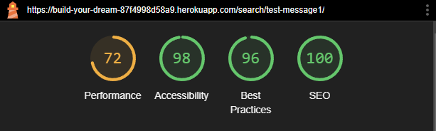
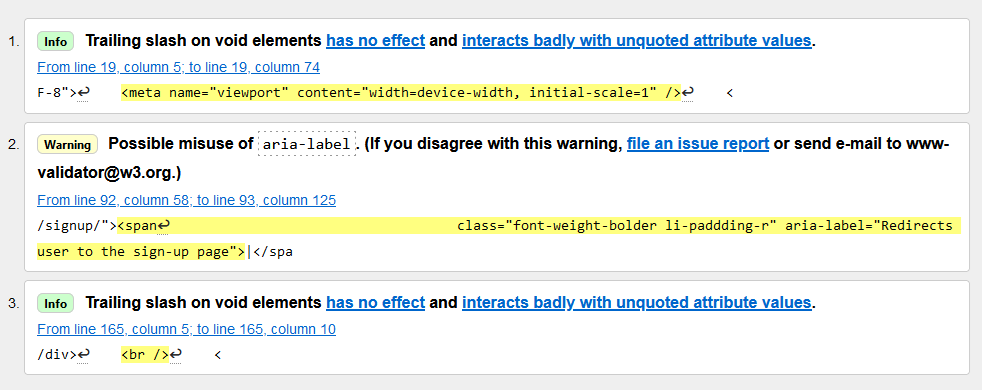
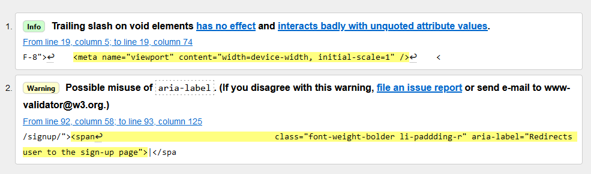
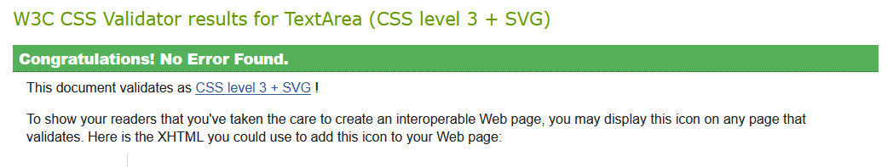

# Build your Dream
Build your dream is a imaginary blog where users can share their own pc builds, find inspiration from other builds and interact with other pc-builders. Here everyone can see what is out there before, during and after building your own computer. 

It is meant to be a place for people to exchange information and just show off their work. Hence the target audience are pc enthusiats who want to present their own build with helpful imformation for future pc builders and for those future pc-builders to get inspired by others work.
The post will have professional tags by the build-your-dream-team so that users can search through the contents by parts and characteristics they are looking for. Moreover users can express their feelings about a post via comments and a like function.

Moreover as this imaginary website is still new and wants to adapt to the users' needs, users can give recommendation of what changes and possible features they would implement on the blog. Therefore, Build Your Dream tries to build a growing community of builders that want to exchange information with one another in a respectful way.

[Build Your Dream - Deployed website](https://build-your-dream-87f4998d58a9.herokuapp.com/)

## Contents
- [SITE OWNER GOALS](#site-owner-goals)
- [USER EXPERIENCE (UX)](#user-experience-ux)
- [WIREFRAMES](#wireframes)
- [AGILE](#agile)
- [ENTITY RELATIONSHIP DIAGRAM - ERD](#entity-relationship-diagram---erd)
- [FINAL DESIGN](#final-design)
    - [Imagery](#imagery)
    - [Color Scheme](#color-scheme)
    - [Typography](#typography)
    - [Visual Effects](#visual-effects)
    - [Final Look](#final-look)
- [FEATURES](#features)
    - [Index Page](#index-page)
    - [Show Build Page](#-page)
    - [Search build via tags](#-page)
    - [Create Build Post](#-page)
    - [Edit Build Post](#-page)
    - [Delete Build Post](#-page)
    - [Future Content](#future-)
    - [404 Page](#404-page)
    - [403 Page](#403-page)
- [TESTING](#testing)
    - [Accessibility](#accessibility)
        - [Wave Testing](#wave-testing)
        - [Lighthouse Testing](#lighthouse-testing)
    - [W3C Validators](#w3c-validators)
    - [JSHint](#jshint)
    - [PEP8](#pep8)
    - [Form Testing](#form-testing)
    - [Links Testing](#links-testing)
    - [Browser Testing](#browser-testing)
    - [Device Testing](#device-testing)
    - [User Stories Testing](#user-stories-testing)
    - [Fixed Bugs](#fixed-bugs)
- [TECHNOLOGIES USED](#technologies-used)
    - [Languages](#languages)
    - [Frameworks, Libraries and Programs used](#frameworks-libraries-and-programs-used)
- [DEPLOYMENT](#deployment)
- [CREDITS](#credits)
    - [Media](#media)
    - [Resources](#resources)
- [ACKNOWLEDGEMENTS](#acknowledgements)

## SITE OWNER GOALS

- to provide the user with an informative website about pc builds
- to provide the user with the ability to become part of a community of pc builders
- to provide the user with the opportunity to upload, edit and delete their own pc build with information about it
- to provide the user with the opportunity to comment on ones own or others' pc builds, the comments can be edited and deleted
- to provide the user with the ability to search all posts via their tags
- to provide the user with the ability to show their appreciation of a post with likes
- to provide the user with the ability give input on what features the website could need and hence become a part of the development process
- to provide the user with a save space, where content is approved so bullying and other problematic behaviour is limited

## USER EXPERIENCE (UX)
#### First Time User Goals
- As a user I can read about pc builds.
- As a user I can register an account so that post content, comment and give feedback.
- As a user I can create a post so that I can show off my build for other users to enjoy.
- As a user I can use any device I want and the design will respond accordingly so that I am not bound to use only one device/browser.
- As a user I can naviagte through the main topics so that I can jump to whichever topic I want from one menu bar.

#### Returning User Goals
- As a user I can rate the post and it's content so that how I thought about the build is represented.
- As a user I can modify or delete my comment on a post so that I can correct my opinion or delete my input from the post.
- As a user I can modify or delete my posts so that I can correct my content or delete it.
- As a user I can comment on a post so that I can give my opinion on the post.
- As a user I can see comments on a post so that can read what other people have to say about the post.

#### Frequent User Goals
- As a user I can create tags on my posts and comments so that it can be searched by them.
- As a user I can search through the posts so that can find what I want to.
- As a user I can view all tags so that I can browse through them.
- As a user I can indicate the status of my input so that I knows if those things will be implemented one day or not.
- As a user I can give input/feedback so that in the future there will be new features on the website.
> additionaly the returning user goals apply here as well

## WIREFRAMES
Wireframes were produced using Balsamiq. 

 

 
Desktop Wireframes

Index Page:

Show Build Post Page:

Add/Edit Build Post Page:

Delete Build Post Page:

Search build via tags Page:

Future Content Page:

Sign-Up Page:

Login Page:

Logout Page:

404 Page:

 

 

    
Mobile Wireframes

Index Page:

Show Build Post Page:

Add/Edit Build Post Page:

Delete Build Post Page:

Search build via tags Page:

Future Content Page:

Sign-Up Page:

Login Page:

Logout Page:

404 Page:

## AGILE
The agile metholody way applied for this project. The To-Do's were split according to their uer stories into sprints. To graphically represent this and not just have each sprint with its goals, tests etc on paper Github's project board was used to show this each springt and tasks as well. As I also use the agile system in my professional life (project management) I didn't always update the digital board and move user stories as I did it in my notes, hence you can see in the documentation of the board that a lot of stories were done at once. However, through my commits one can see that after each small step that worked, and through a lot of testing and fixing the code in between, one can see how this framework was well implemented into each step/sprint of the project.

>[Project Board](https://github.com/users/Xakkusu/projects/5)

My mentor adviced me to only keep sprints that are within the scope of my project. So I also implemented a section called "for next run" where future sprints are in that are possible future features but are not needed in the current project.

##  ENTITY RELATIONSHIP DIAGRAM - ERD
The following diagram illustrates the models used in this project and their relationships to one another:

The user model is created by [Django AllAuth](https://docs.allauth.org/en/latest/) library for user authentication, hence it was not written by me but solely installed and used. The taggit_tag was created by the [django-taggit](https://django-taggit.readthedocs.io/en/latest/) application and used for its well developed tagging system.

## FINAL DESIGN
### Imagery

### Color Scheme

The color palette was created by using the [coolors](https://coolors.co/) website.

### Typography

### Final Look

Desktop

Index Page:

 Page:

404 Page:

Mobile

Index Page:

 Page:

404 Page:

## FEATURES

All pages have the following in common:
#### Navbar

#### Footer

### Index Page

...

### 404 Page

### Future Content Page

## TESTING
### Accessibility
#### Lighthouse Testing
The main problem with my Best Practice score is that cloudinary uses http:// insteast of https:/ when transfering images.
Moreover as the user can upload images whichever format and they are made to fit the cards, the performance suffers through this, especially in mobile view as a third-party cloud-based platform can create succh problems.

##### Desktop
Index Page:

Show Build Post Page:

Create Build Post Page:

Edit Build Post Page:

Delete Build Post Page:

Search Build via Tags Page:

Future Content Page:

Sign-Up Page:

Sign-In Page:

Logout Page:

404 Page:

##### Mobile
Index Page:

Show Build Post Page:

Create Build Post Page:

Edit Build Post Page:

Delete Build Post Page:

Search Build via Tags Page:

Future Content Page:

Sign-Up Page:

Sign-In Page:

Logout Page:

404 Page:

#### Wave Testing
As Wave did not let me sign-in to test pages that only appear as a logged in user, only the pages that are shown without being logged in were tested.
There are some contrast-errors, but as neither lighthouse nor personal testers with minor vision disabilities had problems with them I decided to keep the contrast as it is.

Index Page:

Show Build Post Page:

Create Build Post Page:

Search Build via Tags Page:

Future Content Page:

Sign-Up Page:

Sign-In Page:

404 Page:

### W3C Validators
#### HTML
There were some errors shown in the W3C Markup Validator which I was able to fix like errors with the alpine.js. Here are all the W3C results with minor warnings and tips, which will be looked at when time resource free themselves:

No Errors

Index Page

Create Build Post Page

Edit Build Post Page

Delete Build Post Page

Search via tags Page

Future Content Page

Sign-In Page

Logout Page

Sign-Up Page

#### CSS
No errors were returned for the CSS stylesheet from the W3C CSS Validator:

### JShint
[JSHint](https://jshint.com/) was used to validate the JavaScript.

comments.js

No errors or warnings.

datepiker.js

No errors or warnings.

### PEP8 
No errors were returned for all python files from the [PEP8 CI Python Linter](https://pep8ci.herokuapp.com/) testing:

build_your_dream

No errors or warnings for all python files in build_your_dream.

urls.py:

settings.py:

builds

No errors or warnings for all python files in builds.

urls.py:

admin.py:

forms.py:

models.py:

views.py:

serializers.py:

future_content

No errors or warnings for all python files in future_content.

urls.py:

admin.py:

forms.py:

models.py:

views.py:

### Form Testing

### Links Testing
- All internal links are working and redirecting the user to the pages they are meant to redirect them to. 
- All external links are working and redirecting, through a separate tab, the user to the external website they are meant to be redirected to.

### Browser Testing
The website was successfully tested on the following browsers:
- Google Chrome
- Mozilla Firefox
- Safari
- Microsoft Edge

### Device Testing
- This website was viewed and tested on various devices such as smartphones (Iphone X, Samsung Galaxy S20, Iphone 13, Huawei P40 Pro+), laptops and desktops to guarantee that it is responsive for several screen sizes. Full successful testing was performed on all of the devices.

- The following websites, besides google dev tools, were used to check responsiveness:
    - [Am I Responsive - Index Page](https://ui.dev/amiresponsive?url=https://xakkusu.github.io/)
    - [Am I Responsive -  Page](x)
    - [Am I Responsive - 404 Page](hx)
    - [Responsinator - Index Page](x)
    - [Responsinator - Page](x)
    - [Responsinator - 404 Page](x)

### User Stories Testing
#### First Time User Goals

#### Returning User Goals

#### Frequent User Goals

### Fixed Bugs
1. 

2.  

3. 

### Known Bugs

## TECHNOLOGIES USED
### Languages
- HTML
- CSS
- JavaScript

### Frameworks, Libraries and Programs used
- [Balsamiq](https://balsamiq.com/wireframes/)- Used to create wireframes.
- [GitHub](https://GitHub.com/) - Used for version control and hosting.
- [Gitpod](https://gitpod.io/) - IDE to develop the website.
- [Google Fonts](https://fonts.google.com/) - Used to import  fonts used on the website.
- [Google Chrome Dev Tools](https://developers.google.com/web/tools/chrome-devtools)- Used for troubleshooting, debugging, inspecting page's elements, testing responsiveness and styling elements.
- [Coolors](https://coolors.co/) - Used to create a color palette.
- [Google Chrome's Lighthouse](https://developers.google.com/web/tools/lighthouse) - Used to test performance and accessibility.
- [W3C HTML Markup Validator](https://validator.w3.org/) Used to validate HTML code.
- [W3C Jigsaw CSS Validator](https://jigsaw.w3.org/css-validator/) Used to validate CSS code.
- [JSHint](https://jshint.com/) Used to test all Javascript code.
- [Am I Responsive](https://ui.dev/amiresponsive) Used to test responsiveness.
- [Responsinator](http://www.responsinator.com/) Used to verify responsiveness especially usage for mobile devices.
- Code Institute's Gitpod Template to generate IDE workspace.

## DEPLOYMENT
The steps to deploy this project using GitHub pages were the following:
1. Go to the Settings tab of your GitHub repository.
2. On the left-hand sidebar, in the Code and automation section, select "Pages".
3. Make sure to select the following:
    - Source is set to 'Deploy from Branch'.
    - Main branch is selected.
    - Folder is set to / (root).
4. Click Save next to /root.
5. "Your GitHub Pages site is currently being built from the main branch." shows up.
6. Go back to the Code tab. Wait a few minutes for the build to finish and refresh your repository where a Deployments section will show the deployed project.

The live link can be found here - [X](h)

How to run the project locally:

Fork the repository:
- Log in (or sign up) to Github.
- Go to the repository for: Xakkusu/bioshock-quiz.
- Click the Fork button in the top right corner.

#### Clone repository:
1. Log in (or sign up) to GitHub.
2. Go to the repository for: Xakkusu/bioshock-quiz.
3. Click on the code button, select whether you would like to clone with HTTPS, SSH or GitHub CLI and copy the link shown.
4. Open the terminal in your code editor and change the current working directory to the location you want to use for the cloned directory.
5. Type 'git clone' into the terminal and then paste the link you copied in step 3. Press enter.
6. A clone of the repository will now be created on your machine.

## CREDITS
### Media
The following images were gratefully used:
- [X Image](x) - Wallpapaerflare

### Resources
- Tutorials from Code Institute's lessons that we learned in the course of our diploma-education used to understand the basic concepts of JavaScript. 

- [Stack Overflow](https://stackoverflow.co/)

- [MDN](https://developer.mozilla.org/en-US/)

- [W3Schools](https://www.w3schools.com/)

- 

## ACKNOWLEDGEMENTS
- Code Institute for informative course material.